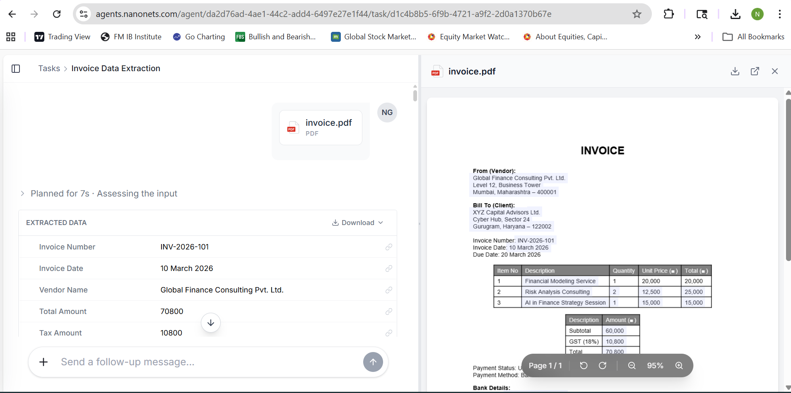
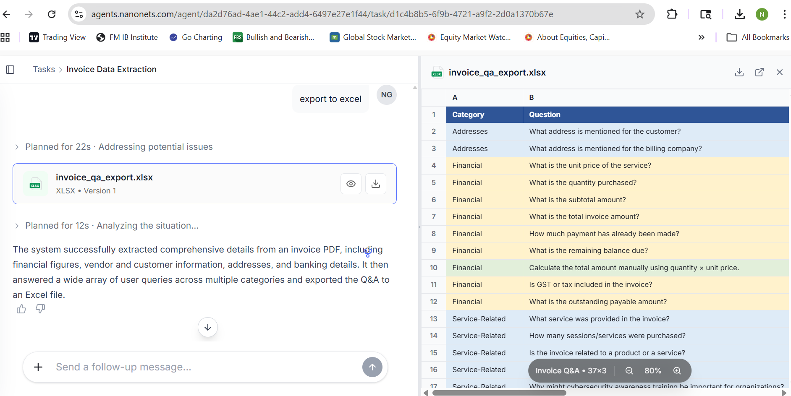
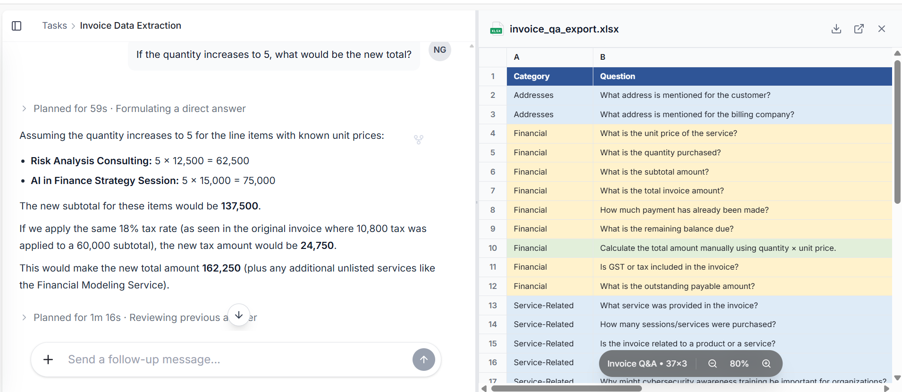
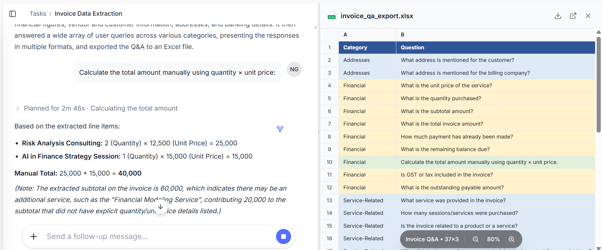

# 🚀 Nanonets

<p align="center">
  
  
  
</p>

---

# 📌 Overview

**Nanonets** is a GitHub repository for managing and storing image assets and project resources.

The repository currently contains uploaded PNG screenshots/images along with an MIT license setup. This project can later be expanded into AI/ML workflows, dataset storage, image processing pipelines, or computer vision applications.

---

# 🖥️ Repository Preview

The screenshot below shows the current GitHub repository structure.

<p align="center">
  
</p>

---

# 📂 Repository Structure

```bash
Nanonets/
│
├── 1.png
├── 2.png
├── 3.png
├── 4.png
├── 5.png
├── LICENSE
└── README.md
```

---

# 📸 Screenshots Gallery

## Screenshot 1

<p align="center">
  
</p>

---

## Screenshot 2

<p align="center">
  
</p>

---

## Screenshot 3

<p align="center">
  
</p>

---

## Screenshot 4

<p align="center">
  
</p>

---

# ✨ Features

✅ Simple repository structure  
✅ GitHub-hosted image management  
✅ PNG image asset storage  
✅ Open-source MIT License  
✅ Easy cloning and setup  
✅ Ready for future development  
✅ Beginner-friendly organization  

---

# 🚀 Getting Started

## 📥 Clone Repository

```bash
git clone https://github.com/balikusha183-cloud/Nanonets.git
```

---

## 📂 Navigate Into Project

```bash
cd Nanonets
```

---

# 🛠️ Technologies Used

| Technology | Purpose |
|------------|---------|
| GitHub | Repository Hosting |
| Git | Version Control |
| Markdown | Documentation |
| PNG Files | Image Storage |

---

# 📈 Future Improvements

This repository can later be expanded with:

- AI image classification
- Dataset management
- Annotation tools
- Computer vision pipelines
- API integration
- Web dashboard
- Automation workflows

---

# 🤝 Contributing

Contributions are welcome.

## 1️⃣ Fork Repository

Click the **Fork** button on GitHub.

---

## 2️⃣ Create New Branch

```bash
git checkout -b feature-name
```

---

## 3️⃣ Commit Changes

```bash
git commit -m "Added new feature"
```

---

## 4️⃣ Push Changes

```bash
git push origin feature-name
```

---

## 5️⃣ Open Pull Request

Submit your changes for review.

---

# 📝 License

This project is licensed under the **MIT License**.

See the [LICENSE](LICENSE) file for details.

---

# 👤 Author

### GitHub

🔗 https://github.com/balikusha183-cloud

---

# ⭐ Support

If you like this project:

⭐ Star the repository  
🍴 Fork the repository  
📢 Share with others  

---

# 📬 Contact

GitHub: https://github.com/balikusha183-cloud

---

<p align="center">
  Made with ❤️ using GitHub
</p>
